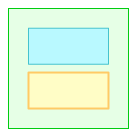

#  路明（Luming）

**路明（Luming）** 是一个面向前端界面开发与快速原型设计的实验性工具。它的核心目标不是替代专业设计软件，而是提供一种**简化、可读的界面结构表达方式**。

在前端开发中，开发者常常需要将抽象的页面想法、布局草图或交互思路转化为可视化结果。传统设计工具或矢量图格式往往使用较为繁琐，或者生成的结果难以直接映射为可复用的代码组件。  

 Luming 的设计哲学正是针对这一空白：**让页面结构、布局关系与视觉层级可以通过清晰、简洁的文本语言进行表达，同时保留生成预览的能力**。

## 特性

- 基于文本的 DSL（Domain-Specific Language）描述界面结构  
- 支持**包含关系**、**上下/左右排列**及**条件显示**  
- 分离结构与样式修饰，保持页面层级清晰  
- 可与 AI 或自动化工具结合，映射为前端组件（Vue、React 等）  

## 快速开始

```text
Header / Sidebar + Main [ Tabs / Content [Form / Preview]] / Footer
Main: bg #fda; 70;
Tabs: tab;
Form: rd 4;
```
在这个示例中，我们定义了一个包含 Header、Sidebar、Main 和 Footer 的页面结构。Main 内部包含 Tabs 和 Content，Content 又包含 Form 和 Preview。通过简洁的语法，我们可以清晰地表达页面的层级关系和布局方式。

在结构之外，我们还可以为每个组件添加样式修饰，例如 Main 的背景色、Tabs 的标签样式、Sidebar 的宽度以及 Form 的圆角。这些样式是独立于结构定义的，保持了页面层级的清晰，同时也提供了足够的灵活性来调整视觉效果。

它可以被解析为一个可视化的界面预览：


或者进一步转换为前端代码组件：

```vue
<script setup>
// App.vue
import Header from './components/Header.vue';
import Sidebar from './components/Sidebar.vue';
import Main from './components/Main.vue';
import Footer from './components/Footer.vue';
</script>

<template>
    <Header />
    <Sidebar />
    <Main />
    <Footer />
</template>

<style scoped>
</style>
```

```vue
<script setup>
// Main.vue
import Tabs from './Tabs.vue';
import Content from './Content.vue';
export default {
  components: {
    Tabs,
    Content
  }
}
</script>

<template>
    <Tabs />
    <Content />
</template>

<style scoped>
</style>
```
或直接生成面向 AI 模型的提示词：

```text
请根据以下描述生成页面布局代码，包括 HTML 和 CSS：
- 页面从上到下依次为 Header、tmp_123、Footer 3部分，从上到下。
- tmp_123 包括 Sidebar 、Main 2 部分，从左到右。
- Main 包含 Tabs 和 Conten 2 部分，从上到下。
- Content 内部包含 Form 和 Preview 2 部分，从上到下。
- Main 的背景色为 #fda，宽度为 70%。
- Tabs 的样式为 tab，具体样式为 ......
- Form 的圆角为 4px。

额外需求包括：
- 生成的代码应使用现代的 HTML5 和 CSS3 标准。
- 代码应具有良好的可读性和结构化，便于后续维护和扩展。
- 生成的 CSS 应该尽可能简洁，避免冗余的样式定义。
```

尽管 Luming 无法直接生成完整的设计稿或高保真原型，或生成完全可用的前端代码，但 Luming 的目标是提供一种 **快速表达和迭代界面结构的工具**，帮助开发者快速预览原型，搭建可用的组件骨架，这在 Vibe Coding 中尤其有用。

## 预览与编译：

 Luming 会自动在预览模式中为每个组件添加一些基础的样式，以确保它们在视觉上是可见的，并且能够清晰地展示它们之间的层级关系。这些基础样式包括：

- **边框**：每个组件都会有一个默认的边框，以便在预览中清晰地看到组件的边界。
- **层次与边框颜色**：不同层级的组件会分配不同的边框颜色，以帮助区分它们之间的层级关系。
- **内外边距**：组件会有一些默认的内外边距，以确保内容不会紧贴边框。
- **组件名称**：每个组件的名称会显示在组件内部，以便在预览中识别它们。

当你显式地指定样式时，这些基础样式会被覆盖。例如，如果你为一个组件设置了 `border: none`，它将不再显示边框。或者如果你为一个组件设置了特定的背景色或边框颜色，这些样式将覆盖默认的样式。

在编译模式下， Luming 只会生成你显式指定的样式，而不会包含任何默认的样式。这意味着如果你没有为组件指定任何样式，生成的代码将不会包含任何样式属性。但布局必须的 CSS 属性（如 `display: flex`、`flex-direction` 等）会被自动添加，以确保组件的布局关系正确。


# 语法 v0.1

 Luming 的语法设计旨在简洁、直观，能够快速表达界面结构和布局关系。以下是 v0.1 版本的基本语法规则：

## 组件名称
组件通过名称定义，组件名称必须以字母开头，可以包含字母、数字和下划线。多个组件可以通过空格、换行或组件关系表达符分隔。例如：

```
Part1
A
camelCaseName
under_score_name
```

在同一个文档中，同一个组件名称可以在多行出现，它们会被视为同一个组件。用户无须写下超长单行来表达复杂的层级关系。例如：

```
Header / Sidebar + Main [ Tabs / Content [Form / Preview]] / Footer
```

等效于：

```
Header / Sidebar + Main  / Footer
Main [ Tabs / Content ]
Content [Form / Preview]
```

等效于：
```
Header / Sidebar + Main  / Footer
                   Main [ Tabs / Content ]
                                 Content [Form / Preview]
```
但当同一行出现多个同名组件时，它们会被视为同一组件的多个不同副本实例，例如：

```
List [Item Item Item]
```


## 组件关系表达符：

 `A / B` 表示在同一层级，A 在上，B 在下。这是无排版的 HTML 文档中最常见的排列关系。  

 `A + B` 表示 A 和 B 在同一层级，A 在左，B 在右。

 `C [ A / B ]` 表示 C 是 A、B 的容器。

**`()`** 表示在同层内，强制优先级处理。例如：`A + (B / C)` 表示 A 在左，B 和 C 在 A 的右边的同一层级，B 在上，C 在下。而 `A + B / C` 则表示 A 和 B 在同一层级，A 在上，B 在下，而 C 在 B 的下方。

### 关系优先级


## 样式：

Luming 的设计目标是快速表达和迭代界面结构，并不旨在替代专业的设计工具或生成高保真的设计稿。因此它主要关注于布局和层级关系，而不是细节的视觉设计。尽管如此， Luming 支持直接使用 CSS 样式，也提供了一些常用 CSS 的缩写简写，甚至直接提供了若干预定义的 CSS 类以节约这部分时间，具体列表可以[参考文档](./docs/style.md)。

**`:` `;`** 表示样式修饰，例如：`A: bg #fda; 70;` 表示组件 A 的背景色为 #fda，宽度为 70%。每个样式属性之间用分号分隔，样式修饰部分以冒号开头，样式属性可以是完整的 CSS 样式，或由 luming 预置提供的缩写或样式类。[参考](./docs/style.md)。


### 组合式语法

用户可以使用多行来表达同一个组件的层级关系和样式修饰，以增强可读性。相反，用户也可以将所有的层级关系和样式修饰写在同一行，以增强简洁性。例如：

```
H / L + R [ T / V ]: bg #fda; 70;/F
```

### 运算规则歧义辨析

* 


### 规则宽容

Luming 允许一些宽容的语法规则，以提高用户的输入效率和自身的容错能力：

* 任意数量的空格，\tab 在语法上都被视为一个空格，以便增强 Luming 文档的排版能力。关系符左右的空格也是可选的。

* 左右排列的组件需要用 `+` 连接，但如果它们是在 [] 内部的同一层级，且不再有其它会引起歧义的关系符时，可以省略 `+`，例如：`A [ B C[D E] ]` 等价于 `A [ B + C[D+E]]`。但仍需空格分隔，否则 `BC` 会被视为另一个组件名称。

* 样式语法中结尾的 ; 如果在行末或者与关系符相邻，可以省略，例如：`A: bg #fda; 70` 等价于 `A: bg #fda; 70;`。`A: bg #fda;/Footer` 等价于 `A: bg #fda/Footer`。


# 语法 v0.2

 

添加图片语法和组件内文本语法。

# 语法 v0.3

 添加条件显示语法。

# 使用

## 预览与编译

 Luming 并非真正的可编译语言，其预览和编译模式实质是同一个结构转换器，它将 Luming 文本描述转换为可视化预览或结构化的前端代码组件。两种模式的区别在于：

* **预览模式**：在预览模式下， Luming 会尽可能生成单一的 html 文档，在一个文档内嵌入入所有的 html css js 内容，以便被其它工具或浏览器直接渲染。在这个模式下， Luming 会自动为每个组件添加一些基础的样式，以确保它们在视觉上是可见的，并且能够清晰地展示它们之间的层级关系。这些基础样式包括边框、层次与边框颜色、内外边距以及组件名称等，以帮助用户在预览中识别和区分不同的组件。

* **编译模式**：在编译模式下， Luming 会将每个组件单独生成一个文件，并且只包含你显式指定的样式属性，和必要的布局属性。通过参数控制，你可以选择生成 Vue、React 或其他框架的组件代码。多个组件之间的关系会通过 import 语句或其他方式进行连接，以确保它们能够正确地组合成一个完整的界面。

    > _要注意的是，用户可以使用 Luming 写出复杂的界面结构，但由于 Luming 编译模式会为每一个组件生成一个独立的文件，一个复杂结构可能会生成大量的文件，需要合理组织和管理。_

* **编译时转换**：由于 html 本身存在的限制， Luming 在编译时会对一些特殊的组件名称进行转换。例如，如果你定义了一个组件名称为 `Header`，在编译时它可能会被转换为 `MyHeader` 或其他名称，以避免与 HTML 中的 `<header>` 标签冲突。这些转换规则可以通过配置文件进行调整，以满足不同项目的需求。 Luming 不会使用随机字符串来生成组件名称，而是会根据预定义的规则进行转换，以确保生成的组件名称具有一定的可读性和一致性。在复杂工程中， Luming 自动转换后的组件名称仍有可能会与现有的组件名称发生冲突。这种使用场景与 Luming 的设计目标并不匹配，建议在这种情况下手动调整配置，以使生成的代码免于冲突。

## Markdown 集成

你可以在 Markdown 中使用代码块的方式来定义 Luming 的界面结构，例如：

<pre>
&grave;&grave;&grave;luming<br>
Header / Sidebar + Main [ Tabs / Content [Form / Preview]] / Footer<br>
&grave;&grave;&grave;
</pre>


# 关于

 路明 （Luming）的名字本身带有隐喻：英文 Luming 来源于 Luminous（发光），中文“ Luming ”则象征光亮的路径和清晰的线路。愿光明照亮前行的道路， Luming 以文本勾勒界面结构的轮廓，为设计者提供一种“可视化的思维线路”。它不是精细美学的替代品，而是辅助工具——让创意、结构和代码之间的桥梁更加轻量、高效且易于理解。