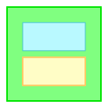

#  **Luming**（路明）

[简体中文](./README.zh-CN.md) | [English](./README.md)

<span style='color: #ffb464; font-weight: bold;'>**Luming**</span> is a textual language and accompanying implementation tool used to describe static page structures. Its core goal is **to provide a simplified, readable textual expression for webpage interface structures.**

## Why Luming?

In front-end development, developers often need to translate abstract page ideas, layout sketches, or interaction concepts into visual results. Traditional design tools or vector graphic formats can be cumbersome to use, or the results they generate are difficult to map directly into reusable code components.

**Luming**'s design philosophy addresses this gap: **Allowing page structure, layout relationships, and visual hierarchy to be expressed through clear, concise text, while retaining the ability to generate previews.**

Goals:

* Express page structure hierarchy using concise text
* Enable version control (diff-friendly)
* Quickly generate structural previews
* Compatible with Vibe Coding and structural communication 

Features:

* Text-based DSL for describing interface structures
* Supports features like **composition**, **layout**, and **declarative overrides**
* Separates structure from style modifications, maintaining clear page hierarchy
* Can be combined with AI or automation tools to map to front-end components (Vue, React, etc.)

Constraints:

* Not a replacement for visual design tools
* Not a CSS substitute
* Not a front-end framework
* Not a dynamic templating language

## Quick Start

```text
Header / Sidebar + Main [ Tabs / Content ] / Footer
Content [Form / Preview]

Main: bg #fda; 70;
Tabs: label;
Form: rd 4;
```
The above text can be parsed by **Luming** into a visual interface preview:


Or further, to generate front-end code components:

```vue
<script setup>
// App.vue
import Header from './components/Header.vue';
import Sidebar from './components/Sidebar.vue';
import Main from './components/Main.vue';
import Footer from './components/Footer.vue';
</script>

<template>
    <Header />
    <Sidebar />
    <Main />
    <Footer />
</template>

<style scoped>
</style>
```

```vue
<script setup>
// Main.vue
import Tabs from './Tabs.vue';
import Content from './Content.vue';
export default {
  components: {
    Tabs,
    Content
  }
}
</script>

<template>
    <Tabs />
    <Content />
</template>

<style scoped>
</style>

...
```
Or directly generate prompts for AI models:

```text
Please generate page layout code, including HTML and CSS, based on the following description:
- The page consists of three parts from top to bottom: Header, tmp_123, Footer, arranged vertically.
- tmp_123 consists of two parts: Sidebar and Main, arranged horizontally.
- Main contains Tabs and Content, arranged vertically.
- Content internally contains Form and Preview, arranged vertically.
- Main has a background color of #fda and a width of 70%.
- Tabs uses the 'label' style, with the specific style being ...
- Form has a border radius of 4px.

Additional requirements include:
- The generated code should use modern HTML5 and CSS3 standards.
- The code should be well-readable and structured for easy maintenance and extension.
- The generated CSS should be as concise as possible, avoiding redundant style definitions.
- Each main entity I define (such as Header, Sidebar, Main, etc.) should be implemented as an independent module or component for reuse in actual projects.
- The generated code should consider responsive design to adapt to different screen sizes and device types.
```

In the quick example, we defined a page structure containing Header, Sidebar, Main, and Footer. Inside Main, there are Tabs and Content, and Content further contains Form and Preview. With concise syntax, we can clearly express the page's hierarchical relationships and layout.

Beyond the structure, we can also add style modifiers for each entity, such as Main's background color, Tabs' label style, Sidebar's width, and Form's border radius. These styles are defined separately from the structure, keeping the page hierarchy clear while providing enough flexibility to adjust the visual effect.

Although **Luming** cannot directly generate complete design drafts or high-fidelity prototypes, or produce fully functional front-end code, its goal is to provide **a tool for quickly expressing and iterating on web interface structures**, helping developers rapidly prototype and build usable component skeletons, which is particularly useful in Vibe Coding.

# Syntax v0.1

<span style='color: #ffb464; font-weight: bold;'>**Luming**</span>'s syntax is designed to be concise and intuitive, allowing for the quick expression of interface structures and layout relationships. Here are the basic syntax rules for version v0.1:

## Entity Names

* Entities are defined by names, which must start with a letter and can contain letters, numbers, and underscores. Multiple entities can be separated by spaces, newlines, or relationship operators. For example:

  ```
  Part1
  A
  camelCaseName
  under_score_name
  ```

* Within the same document, the same entity name can appear on multiple lines, and they will be treated as the same entity. Users do not need to write overly long single lines to express complex hierarchies. For example:

  ```
  Header / Sidebar + Main [ Tabs / Content [Form / Preview]] / Footer
  ```

  is equivalent to:

  ```
  Header / Sidebar + Main  / Footer
  Main [ Tabs / Content ]
  Content [Form / Preview]
  ```

  is equivalent to:

  ```
  Header / Sidebar + Main / Footer
                     Main [ Tabs / Content ]
                                   Content [ Form / Preview]
  ```

* When multiple same name entities appear on the same line, they are treated as multiple distinct copies of that entity. For example:
  ```
  List [Item Item Item]
  Item [ Icon Text ]
  ```
  is equivalent to:
  ```
  List [Item[ Icon Text ] Item[ Icon Text ] Item[ Icon Text ]]
  ```

> To clarify again, **Luming**'s goal is not to directly generate production-ready engineering code, and it does not include features like component instantiation, lifecycle methods, or mixins. Allowing multiple entities with the same name on one line is because this is a very common and typical scenario in prototyping interfaces. However, in actual engineering, the cyclic reuse of components is often related to iterating over real business data, which is handled by engineering code generation. **Luming** does not help you generate loop code; it only helps you quickly express this structural relationship during the prototyping phase for iteration and preview.

## Layout Relationship Expressions

 ：`A / B` means A is above B at the same hierarchical level. This is the most common arrangement in uncomposed HTML documents.

 ：`A + B` means A and B are on the same level, with A to the left and B to the right.

 ：`C [ A / B ]` means C is the container for A and B. `[]` indicates a containment relationship.

：`A + B / C` means A is at the top-left, B at the top-right, and C is below A and B, all on the same hierarchical level.

：`A + (B / C)` means A is on the left, B is at the top, and C is at the bottom-right, all on the same level. `()` indicates forcing priority within the same level. That is, B and C are grouped together first, then this group is arranged horizontally with A.

Note: The `()` grouping symbol is a special one, implemented differently in various layout schemes. In flexbox layouts, or older in float layouts, an extra container element is needed to achieve the corresponding effect. In such cases, `()` is equivalent to an anonymous `[]`. For Grid layout, no extra container element is required; elements are arranged directly within the same level. According to **Luming**'s design philosophy, `()` is semantically defined as '**layout operation priority**' rather than directly mapping to an anonymous container or hierarchical relationship.

## Operator Precedence

Within the same line, the precedence of operators is: `[]` > `()` > `+` > `/`。

* For example, for `A + B / (C / D [ E + F ])`, first `[]` is processed, grouping E and F horizontally as a whole, making it the content of D.
* Then, within `A + B / (C / D)`, `()` is processed, grouping C and D vertically as a whole.
* Third, `+` is processed, grouping A and B horizontally as a whole.
* Finally, `/` is processed, grouping A+B and C/D vertically as a whole.

Alternatively, think of it this way:
  
* First, extract the contents within `[]` and `()`.
* Then, use `/` to split the entities and parenthesized groups, arranging them vertically.
* Finally, check within each group for `+`, and arrange horizontally if present. 
* For example, `A / B + C + D / E` is equivalent to `A / (B + C + D ) / E`

Unlike arithmetic operators, there is no inherent rule in page layout that division is tighter than addition. Considering that page layout naturally flows from top to bottom, **Luming** chose a precedence rule that processes vertical relationships first, then horizontal relationships within the same level, aligning better with the natural hierarchy of page structures.

## Styles

`: ;`: Content between `:` and `;` represents style modifications. For example: `A: bg #fda; 70;` means entity A has a background color of #fda and a width of 70%. Style properties are separated by semicolons. The style modification part starts with a colon and ends with a semicolon. Style properties can be complete CSS styles, or abbreviations or style classes provided by **Luming**'s presets.

**Luming**'s design goal is to quickly express and iterate on interface structures, not to replace professional design tools or generate high-fidelity design drafts. It primarily focuses on layout and hierarchical relationships, rather than detailed visual design. Nevertheless, **Luming** supports direct use of CSS styles and also offers some common CSS shorthand abbreviations and even several predefined CSS classes to save time. For a specific list, please refer to [the documentation](./docs/style.md).

## Compositional Syntax

用户可以使用多行来表达同一个主体的层级关系和样式修饰，以增强可读性。相反，用户也可以将所有的层级关系和样式修饰写在同一行，以缩减行数。例如：

Users can use multiple lines to express the hierarchical relationships and style modifications of the same entity for better readability. Conversely, users can also write all hierarchical relationships and style modifications on a single line to reduce line count. For example:

```
H / L + R / F
R[ T / V ]
R: bg #fda; 70;
```

is equivalent to

```
H / L + R [ T / V ]: bg #fda; 70;/F
```

## Advanced Usage

**Luming** allows users to define styles or properties for the same entity multiple times within the same document, and also permits the use of compositional syntax for more flexible expression. These mechanisms are initially intended to enhance the readability of **Luming** documents, but this flexibility also brings additional features to **Luming**:

* Inline Repetition: When multiple entities with the same name appear on the same line, they are treated as multiple distinct copies of that entity. For example:

  ```
  List [Item Item Item]
  ```

* Entity Style vs. Individual Copy Style:

  ```
  List [Item: bg #99f; Item Item]
  Item: bg #f99;
  ```
  The final effect is that the first Item inside List has a background color of <span style="background-color: #99f;">#99f</span>, while the second and third Items have a background color of <span style="background-color: #f99;">#f99</span>.

* Subsequent Definitions Override Previous Definitions:
  
  When the same entity is defined multiple times in a document, later defined properties override earlier ones. For example:
  ```
  A: bg #fda; 70;
  A: bg #99f;
  ```

  The final effect is that A's background color is <span style="background-color: #99f;">#99f</span>, and its width remains 70%.

  The same rule applies to hierarchical relationships and containment. For example:

  ```
  A / B
  A + B
  ```
  The final effect is that A and B are on the same level, with A on the left and B on the right.

  ```
  A [ B C ]
  A [ D E ]
  ```
  The final effect is that A contains D and E, while B and C are no longer content of A.

* Reusing Copies

  There are two ways to reuse copies of the same entity:
  
  ```
  List [Item Item Item]
  ```
  and
  ```
  Page [ Content ]
  Main [ Content ]
  ```
  Note that this is not a case of a subsequent definition overriding a previous one. The definition of Main does not override the definition of Page, and vice versa. They simply share a Content entity. During the rendering phase, two copies of Content will be generated, one placed inside Page and one inside Main.

* Finite Expansion

  ```
  A [A]

  B [C]
  C [B]
  ```
  In **Luming**'s design, circular inclusion is allowed but is explicitly defined as finite expansion. When an entity directly or indirectly includes itself within its expanded hierarchical relationship, the **Luming** parser will expand that entity again as a copy and check if the current expansion forms a loop, at which point it stops. The entity ultimately becomes both the start and end point of a cycle. For the two examples above, the final results are:

  ```
  A
  └─A(Terminus)
  B
  └─C
    └─B(Terminus)
  ```


## Further Understanding

To understand the principles behind the advanced usage, it's necessary to know the processing flow of the **Luming** parser.

**Luming** is a simple descriptive language, not a full runtime environment. It does not have true variables, functions, or lifecycle mechanisms. Its processing flow can be divided into the following stages:

**Text Parsing**: The **Luming** parser first parses the input text line by line, identifying entity names, hierarchical relationships, style modifications, and other elements from each line, and converts the source code into the parser's own internal data structures.

When subsequent lines contain the same entity name, **Luming** merges them into the existing data structure according to specific rules. Therefore, later definitions can override earlier ones. However, different properties may have different handling methods when conflicts occur. For detailed handling rules, please refer to [the documentation](./docs/parser.md).

**Copy Generation**: After parsing is complete, the generator produces a visual preview or front-end code components based on the parsed data structure. During this phase, the generator traverses the hierarchical relationships and style modifications of entities to generate corresponding HTML, CSS, and JavaScript code. If an entity is not contained by any other entity, it will generate independent copies in the order they first appear in the document; if an entity might be contained by others in any position, it will only generate copies within those containing positions.

**Code Composition**: During code generation, the generator will, based on input parameters, append relevant code corresponding to the specific mode when combining the generated entity copies.

Therefore, **Luming**'s text parsing does not have a situation where 'a definition in a subsequent line overrides properties of a copy that already existed in a previous line'. This is because all copies are ultimately generated globally, not processed locally line by line in real-time.

## Rule Tolerance

**Luming** establishes some tolerant syntax rules to improve user input efficiency and its own error resilience:

* Any number of spaces or tabs are treated as a single space syntactically, enhancing the formatting capabilities of **Luming** documents. Spaces around relationship operators are also optional.

* Entities arranged horizontally need to be connected with `+`. However, if they are within `[]` at the same level and there are no other operators that could cause ambiguity, the `+` can be omitted. For example: `A[B C[D E]]` is equivalent to `A [ B + C [ D + E ] ]`. Spaces are still required for separation; otherwise, `BC` would be interpreted as another entity name.

* 样式语法中结尾的 ; 如果在行末或者与关系符相邻，可以省略，例如：`A: bg #fda; 70` 等价于 `A: bg #fda; 70;`。`A: bg #fda;/Footer` 等价于 `A: bg #fda/Footer`。
* The trailing `;` in style syntax can be omitted if it is at the end of a line or adjacent to a relationship operator. For example: `A: bg #fda; 70` is equivalent to `A: bg #fda; 70;`. `A: bg #fda/Footer` is equivalent to `A: bg #fda;/Footer`.

## Best Practices

* Always start defining the interface structure with unique main entity, avoiding overly generic names (like Container, Wrapper), to improve readability and maintainability.

* Avoid arranging layout based on line order. Use explicit relationship expressions (like `/`, `+`, `[]`) to define hierarchical and layout relationships for enhanced structural clarity. Avoid undefined parser behavior.

* When defining styles for the same entity, try to do so on the same line or adjacent lines to avoid confusion caused by subsequent lines overriding previous ones.

* Although **Luming** explicitly defines the handling rules for circular references, complex hierarchical relationships like circular references should still be avoided, as they generally do not conform to standard interface structure design principles.

* Prefer using explicit containment `[]` to define component hierarchies rather than relying on `()` to forcibly adjust layout priority, for maximum compatibility with the compilation results.

* Minimize the excessive use of CSS styles; try to use preset style classes or abbreviations, and especially avoid using selectors. Pursuing detailed visual effects is not **Luming**'s strength; users should consider professional design tools like Sketch or Figma for visual design.

# Syntax v0.2

 

Add syntax for images and inner text of entities.

# Syntax v0.3


Add conditional display syntax.

# Usage

<span style='color: #ffb464; font-weight: bold;'>**Luming**</span> provides a command-line tool to compile its textual descriptions into visual previews or structured front-end code components. To cater to different scenarios, **Luming** offers two invocation methods: Preview Mode and Generate Mode.

## Preview Mode

In preview mode, **Luming** will generate a single HTML document as much as possible, embedding all HTML, CSS, and JavaScript content within one file, so it can be directly rendered by browsers or other tools. In this mode, **Luming** automatically adds some basic styles to each entity to ensure they are visually discernible and clearly demonstrate the hierarchical relationships between them. These basic styles include:

* **Borders**: Each entity has a default border, making its boundaries clearly visible in the preview.

* **Hierarchy & Border Colors**: Entities at different hierarchical levels are assigned different border colors to help distinguish their relationships.

* **Margins & Padding**: Entities have some default margins and padding to ensure content doesn't stick to the borders.

* **Entity Names**: The name of each entity is displayed inside it for easy identification in the preview.

When you explicitly specify styles, these basic styles are overridden. For example, if you set `border: none` for an entity, its border will no longer be displayed. Or if you set a specific background color or border color for an entity, those styles will override the defaults.

## Generate Mode

In generate mode, **Luming** creates a separate file for each entity, containing only the style attributes you explicitly specified and the necessary layout attributes. This means if you don't specify any styles for an entity, the generated code will contain no style attributes. However, essential CSS properties for layout (like `display: flex`, `flex-direction`, etc.) are automatically added to ensure the entity's layout relationships are correct.

Through parameter control, you can choose to generate component code for Vue, React, or other frameworks. Relationships between multiple components are connected via import statements or other means to ensure they can be correctly combined into a complete interface.

Note: Users can write complex interface structures using **Luming**, but since **Luming**'s generate mode creates a separate file for each component, a complex structure might generate a large number of files, requiring proper organization and management.

## Generation-Time Transformation:

Due to limitations inherent in HTML, **Luming** transforms certain specific component names when compiling and generating component files. For example, if you define an entity named `Header`, it might be transformed to `MyHeader` or another name during compilation to avoid conflicts with HTML's `<header>` tag. These transformation rules can be adjusted via configuration files to meet the needs of different projects. **Luming** does not use random strings for component names; it transforms them according to predefined rules to ensure the generated component names have a degree of readability and consistency. In complex projects, there is still a possibility that **Luming**'s automatically transformed component names might conflict with existing component names; it is recommended to manually adjust the configuration in such cases.

## Markdown Integration


<pre>
&grave;&grave;&grave;**Luming**<br>
Header / Sidebar + Main [ Tabs / Content [Form / Preview]] / Footer<br>
&grave;&grave;&grave;
</pre>


# About

<span style='color: #ffb464; font-weight: bold;'>**Luming** (路明)</span> the name itself carries a metaphor: The English word "**Luming**" can be understood as Luminous, while the Chinese characters <span style='color: #ffb464; font-weight: bold;'>路明</span> (Lù Míng) symbolize a bright roadway and a clear route,  wishing for light to illuminate your way forward. **Luming** outlines the contours of interface structures with text, providing designers with a kind of "visual thinking line." It is not a substitute for fine aesthetics, but an auxiliary tool — making the bridge between ideas, structure, and code lighter, more efficient, and easier to understand.