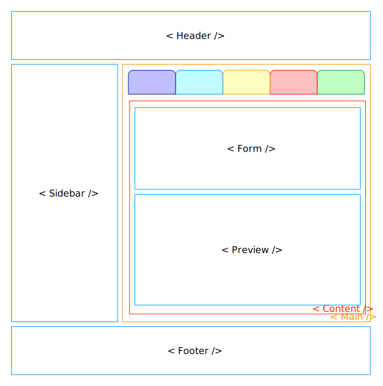
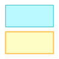
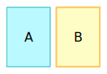
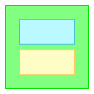
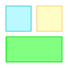
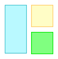
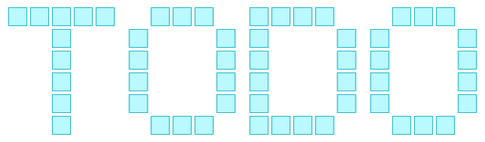

#  路明（Luming）

[简体中文](./README.zh-CN.md) | [English](./README.md)

<span style='color: #ffb464; font-weight: bold;'>**路明（Luming）**</span> 是一种用于描述静态页面结构的文本语言和配套实现工具。它的核心目标是提供一种 **简化、可读的界面结构表达语言**。

## Why Luming?

在前端开发中，开发者常常需要将抽象的页面想法、布局草图或交互思路转化为可视化结果。传统设计工具或矢量图格式往往使用较为繁琐，或者生成的结果难以直接映射为可复用的代码组件。

路明 的设计哲学正是针对这一空白：**让页面结构、布局关系与视觉层级可以通过清晰、简洁的文本语言进行表达，同时保留生成预览的能力**。

目标：

* 用简洁文本表达页面结构层级
* 可进行版本控制（diff-friendly）
* 可快速生成结构预览
* 辅助 Vibe Coding 和结构沟通

特性：

- 基于文本的 DSL，描述界面结构  
- 支持 **组合**、**布局**、**覆盖式声明** 等特性
- 分离结构与样式修饰，保持页面层级清晰  
- 可与 AI 或自动化工具结合，映射为前端组件（Vue、React 等）  

约束：

* 不是视觉设计替代工具
* 不是 CSS 替代品
* 不是前端框架
* 不是动态模板语言

## 快速开始

```text
Header / Sidebar + Main [ Tabs / Content ] / Footer
Content [Form / Preview]

Main: bg #fda; 70;
Tabs: label;
Form: rd 4;
```
以上文本可以被 路明 解析为一个可视化的界面预览：



或者进一步生成前端代码组件：

```vue
<script setup>
// App.vue
import Header from './components/Header.vue';
import Sidebar from './components/Sidebar.vue';
import Main from './components/Main.vue';
import Footer from './components/Footer.vue';
</script>

<template>
    <Header />
    <Sidebar />
    <Main />
    <Footer />
</template>

<style scoped>
</style>
```

```vue
<script setup>
// Main.vue
import Tabs from './Tabs.vue';
import Content from './Content.vue';
export default {
  components: {
    Tabs,
    Content
  }
}
</script>

<template>
    <Tabs />
    <Content />
</template>

<style scoped>
</style>

...
```
或直接生成面向 AI 模型的提示词：

```text
请根据以下描述生成页面布局代码，包括 HTML 和 CSS：
- 页面从上到下依次为 Header、tmp_123、Footer 3部分，从上到下。
- tmp_123 包括 Sidebar 、Main 2 部分，从左到右。
- Main 包含 Tabs 和 Conten 2 部分，从上到下。
- Content 内部包含 Form 和 Preview 2 部分，从上到下。
- Main 的背景色为 #fda，宽度为 70%。
- Tabs 的样式为 label，具体样式为 ......
- Form 的圆角为 4px。

额外需求包括：
- 生成的代码应使用现代的 HTML5 和 CSS3 标准。
- 代码应具有良好的可读性和结构化，便于后续维护和扩展。
- 生成的 CSS 应该尽可能简洁，避免冗余的样式定义。
- 每个我定义的主体（如 Header、Sidebar、Main 等）都应该被实现为一个独立的模块或组件，以便在实际项目中进行复用。
- 生成的代码应考虑响应式设计，以适应不同屏幕尺寸和设备类型。
```

在快速示例中，我们定义了一个包含 Header、Sidebar、Main 和 Footer 的页面结构。Main 内部包含 Tabs 和 Content，Content 又包含 Form 和 Preview。通过简洁的语法，我们可以清晰地表达页面的层级关系和布局方式。

在结构之外，我们还可以为每个主体添加样式修饰，例如 Main 的背景色、Tabs 的标签样式、Sidebar 的宽度以及 Form 的圆角。这些样式是独立于结构定义的，保持了页面层级的清晰，同时也提供了足够的灵活性来调整视觉效果。

尽管 路明 无法直接生成完整的设计稿或高保真原型，或生成完全可用的前端代码，但 路明 的目标是提供一种 **快速表达和迭代界面结构的工具**，帮助开发者快速预览原型，搭建可用的组件骨架，这在 Vibe Coding 中尤其有用。

# 语法 v0.1

<span style='color: #ffb464; font-weight: bold;'>路明</span> 的语法设计旨在简洁、直观，能够快速表达界面结构和布局关系。以下是 v0.1 版本的基本语法规则：

## 主体名称

* 主体通过名称定义，主体名称必须以字母开头，可以包含字母、数字和下划线。多个主体可以通过空格、换行或主体关系表达符分隔。例如：

  ```
  Part1
  A
  camelCaseName
  under_score_name
  ```

* 在同一个文档中，同一个主体名称可以在多行出现，它们会被视为同一个主体。用户无须写下超长单行来表达复杂的层级关系。例如：

  ```
  Header / Sidebar + Main [ Tabs / Content [Form / Preview]] / Footer
  ```

  等效于：

  ```
  Header / Sidebar + Main  / Footer
  Main [ Tabs / Content ]
  Content [Form / Preview]
  ```

  等效于：
  ```
  Header / Sidebar + Main / Footer
                     Main [ Tabs / Content ]
                                   Content [ Form / Preview]
  ```
* 当同一行出现多个同名主体时，它们会被视为同一主体的多个不同副本，例如：

  ```
  List [Item Item Item]
  Item [ Icon Text ]
  ```
  等效于
  ```
  List [Item[ Icon Text ] Item[ Icon Text ] Item[ Icon Text ]]
  ```

> 再次重申，路明 的目标并不是直接生成完备的工程级代码，不包括诸如组件实例化、生命周期、Mixin 等功能。允许同一行出现多个同名主体是因为这是原型界面中非常觉见而典型的场景。但在实际工程中，组件的循环复用往往与实际的业务数据遍历相关，由工程代码生成。路明 并不会帮助你生成循环代码，只帮助你在原型阶段快速表达出这种结构关系，以便迭代和预览。

## 布局关系表达式：

 ：`A / B` 表示在同一层级，A 在上，B 在下。这是无排版的 HTML 文档中最常见的排列关系。  

 ：`A + B` 表示 A 和 B 在同一层级，A 在左，B 在右。

 ：`B [ A / C ]` 表示 B 是 A、C 的容器。`[]` 表示包含关系。

：`A + B / C` 表示 A 左上， B 右上， C 在 A B 的下方，三者同一层级。

：`A + (B / C)` 表示 A 在左，B 在上，C 右下，三者同一层级。**`()`** 表示在同层内，强制优先级处理。也就是说 BC 先合起来，再与 A 进行左右排列关系的处理。

注： `()` 分组符是一个特殊的符号，在不同的布局方案中它有不同的实现方式。在 flex 或更早的 float 布局中，需要借助一个容器元素才能实现对应效果。这种情况下 `()` 等效于一个匿名的 `[]`，对于 Grid 布局来说，则不需要额外的容器元素，而是直接在同一层级内调整元素的排列方式。根据 路明 的设计哲学，`()` 在语义上被定义为『布局运算优先级』而非直接映射为匿名容器或层级关系。

## 关系优先级

在同一行内，关系符的优先级为：`[]` > `()` > `+` > `/`。

* 例如，对于 `A + B / (C / D [ E + F ])`，首先处理 `[]`，将 E 和 F 左右组合成一个整体，作为 D 的内容。
* 然后在 `A + B / (C / D)`处理 `()`，将 C 和 D 上下组合成一个整体
* 第三处理 `+`，将 A 和 B 左右组合为一个整体。
* 最后处理 `/`，将 A+B 和 C/D 上下组合为一个整体。

或者换种理解：

* 先将 `[]` `()` 内的提取出来。
* 再用 `/` 把主体和括号组切分后上下排列。
* 最后再看每组内是否有 `+`，有则左右排列。 
* 例如 `A / B + C + D / E`，等效于 `A / (B + C + D ) / E`

与四则运行符不同，页面布局并不存在除法比加法更紧密的规则。考虑到页面排版天然是从上到下的，路明 选择了在同一层级内先处理上下关系，再处理左右关系的优先级规则，以更符合页面结构的自然层次。

## 样式

**`:` `;`** 之间的内容表示样式修饰，例如：`A: bg #fda; 70;` 表示主体 A 的背景色为 #fda，宽度为 70%。每个样式属性之间用分号分隔，样式修饰部分以冒号开头以分号结尾，样式属性可以是完整的 CSS 样式，或由 路明 预置提供的缩写或样式类。

路明 的设计目标是快速表达和迭代界面结构，并非用于替代专业设计工具或负责生成高保真设计稿。它主要关注于布局和层级关系，而不是细节的视觉设计。尽管如此，路明 支持直接使用 CSS 样式，也提供了一些常用 CSS 的缩写简写，甚至直接提供了若干预定义的 CSS 类以节约时间，具体列表可以[参考文档](./docs/style.md)。

## 组合式语法

用户可以使用多行来表达同一个主体的层级关系和样式修饰，以增强可读性。相反，用户也可以将所有的层级关系和样式修饰写在同一行，以缩减行数。例如：

```
H / L + R / F
R[ T / V ]
R: bg #fda; 70;
```

等效于

```
H / L + R [ T / V ]: bg #fda; 70;/F
```

## 高阶用法

路明 允许用户在同一文档中多次定义同一个主体的样式或属性，也允许使用组合式语法以获得更灵活的表达方式。这些机制的初衷是为了让 路明 文档更具可读性，但这一灵活也为 路明 额外带来了新的特性：

* 行内重复：当同一行内出现多个同名主体时，它们会被视为同一主体的多个不同副本，例如：

  ```
  List [Item Item Item]
  ```

* 主体样式与副本单独样式：

  ```
  List [Item: bg #99f; Item Item]
  Item: bg #f99;
  ```
  最终效果是 List 内的第一个 Item 的背景色为 <span style="background-color: #99f;">#99f</span>，第二、三个 Item 的背景色为 <span style="background-color: #f99;">#f99</span>。

* 后继定义覆盖先前定义：
  
  同一主体在文档中被多次定义时，后定义的属性会覆盖前面的属性，例如：

  ```
  A: bg #fda; 70;
  A: bg #99f;
  ```
  的最终效果是 A 的背景色为 <span style="background-color: #99f;">#99f</span>，宽度仍为 70%。

  同样的规则也适用于层级关系和包含关系，例如：

  ```
  A / B
  A + B
  ```
  的最终效果是 A 和 B 在同一层级，A 在左，B 在右。

  ```
  A [ B C ]
  A [ D E ]
  ```
  的最终效果是 A 包含 D 和 E，而 B 和 C 不再是 A 的内容。

* 复用副本。

  有两种方式可以复用同一主体的副本：
  
  ```
  List [Item Item Item]
  ```
  和
  ```
  Page [ Content ]
  Main [ Content ]
  ```
  请注意，这里并非后续定义覆盖先前定义。Main 的定义并不会覆盖 Page 的定义，反之亦然。它们只是共享了一个 Content 主体。在渲染阶段，Content 会生成两个副本分别置于 Page 和 Main 内。

* 有限展开

  ```
  A [A]

  B [C]
  C [B]
  ```
  在 路明 的设计中，循环包含是允许的，但被明确定义为有限展开。当一个主体在其展开层级关系中直接或间接包含了自己时，路明 解析器会将该主体再次展开为一个副本，并检查当前展开是否形成环路而中止。该主体最终会同时成为一个循环的起点和终点。对于以上两个示例，其最终结果为：
  ```
  A
  └─A(终点)
  B
  └─C
    └─B(终点)
  ```


## 进一步了解

理解高级用法的原理，需要了解 路明 解析器的处理流程。

路明 是一个简单的描述语言，而非完整的运行时环境，它不存在真正意义上的变量、函数或生命周期机制。它的处理流程可以分为以下几个阶段：

**文本解析**：路明 解析器首先会将输入的文本逐行进行解析，从每一行识别出主体名称、层级关系、样式修饰等元素，并将源码转为解析器自有的数据结构。

当后续行出现同名主体时，路明 会按一定规则合并到已有的数据结构中。因此后定义就可能覆盖前定义。但不同的属性在遇到冲突时会有不同的处理方式。详细的处理规则可以参考[文档](./docs/parser.md)。

**副本生成**：在解析完成后，生成器会根据解析得到的数据结构生成可视化预览或前端代码组件。在这个阶段，生成器会遍历主体的层级关系和样式修饰来生成对应的 HTML、CSS 和 JavaScript 代码。如果一个主体没有被其它主体包含，那么它就会按文档中最初出现的顺序生成独立副本；如果一个主体在任何位置可能被其它主体包含，它就只会在被包含的位置生成副本。

**代码组合**：在生成代码的过程中，生成器会根据输入参数，在生成主体副本组合时，额外附加对应模式的相关代码。

因此，路明 的文本解析不存在『后继行的定义覆盖前面行中已经存在的副本属性』的情况。因为所有副本都是在全局范围最后生成的，而不是在行内实时局部处理的。

## 规则宽容

路明 设置了一些宽容的语法规则，以提高用户的输入效率和自身的容错能力：

* 任意数量的空格、\tab 在语法上都被视为一个空格，以便增强 路明 文档的排版能力。关系符左右的空格也是可省略的。

* 左右排列的主体需要用 `+` 连接，但如果它们是在 `[]` 内部的同一层级，且不再有其它会引起歧义的关系符时，可以省略 `+`，例如：`A[B C[D E]]` 等价于 `A [ B + C [ D + E ] ]`。但仍需空格分隔，否则 `BC` 会被视为另一个主体名称。

* 样式语法中结尾的 ; 如果在行末或者与关系符相邻，可以省略，例如：`A: bg #fda; 70` 等价于 `A: bg #fda; 70;`。`A: bg #fda/Footer` 等价于 `A: bg #fda;/Footer`。

## 最佳实践

* 始终从唯一的最底层主体开始定义界面结构，避免使用过于通用的名称（如 `Container`、`Wrapper` 等），以提高可读性和维护性。

* 避免通过行序来上下排版，使用明确的关系表达式（如 `/`、`+`、`[]`）来定义层级关系和布局关系，以增强结构的清晰度。避免解析器的未定义行为。

* 定义同一主体的样式时，尽量在同一行或相邻行进行定义，以避免后继行覆盖带来的混淆。

* 尽管 路明 明确定义了循环引用的处理规则，仍应避免循环引用等复杂的层级关系，这不符合通常的界面结构设计原则。

* 尽量使用显式包含关系（`[]`）来定义组件的层级关系，而不依赖于 `()` 强行调整布局优先级，以获得编译结果最大的兼容性。

* 减少 CSS 样式的过度使用，尽量使用预置的样式类或缩写，尤其不要使用选择器。追求细节的视觉效果并非 路明 的长项，用户应当考虑 Sketch、Figma 等专业设计工具来进行视觉设计。

# 语法 v0.2

 

添加图片语法和主体内文本语法。

# 语法 v0.3


添加条件显示语法。

# 使用

<span style='color: #ffb464; font-weight: bold;'>路明</span> 提供了命令行工具来将自身的文本描述编译为可视化预览或结构化的前端代码组件。为了满足不同场景，路明 提供了预览模式和生成模式两种调用方法:

## 预览模式：

在预览模式下，路明 会尽可能生成单一的 html 文档，在一个文档内嵌入入所有的 html css js 内容，以便被其它工具或浏览器直接渲染。在这个模式下，路明 会自动为每个主体添加一些基础的样式，以确保它们在视觉上是可见的，并且能够清晰地展示它们之间的层级关系。这些基础样式包括：

- **边框**：每个主体都有一个默认的边框，以便在预览中清晰地看到主体的边界。
- **层次与边框颜色**：不同层级的主体会分配不同的边框颜色，以帮助区分它们之间的层级关系。
- **内外边距**：主体会有一些默认的内外边距，以确保内容不会紧贴边框。
- **主体名称**：每个主体的名称会显示在主体内部，以便在预览中识别它们。

当你显式地指定样式时，这些基础样式会被覆盖。例如，如果你为一个主体设置了 `border: none`，它将不再显示边框。或者如果你为一个主体设置了特定的背景色或边框颜色，这些样式将覆盖默认的样式。

## 生成模式

在生成模式下，路明 会为每个主体单独生成一个文件，并且只包含你显式指定的样式属性，和必要的布局属性。这意味着如果你没有为主体指定任何样式，生成的代码将不会包含任何样式属性。但布局必须的 CSS 属性（如 `display: flex`、`flex-direction` 等）会被自动添加，以确保主体的布局关系正确。

通过参数控制，你可以选择生成 Vue、React 或其他框架的组件代码。多个组件之间的关系会通过 import 语句或其他方式进行连接，以确保它们能够正确地组合成一个完整的界面。

_要注意的是，用户可以使用 路明 写出复杂的界面结构，但由于 路明 生成模式会为每一个组件生成一个独立的文件，一个复杂结构可能会生成大量的文件，需要合理组织和管理。_

## 生成时转换：

由于 html 本身存在的限制， 路明 在编译生成组件文件时会对一些特殊的组件名称进行转换。例如，如果你定义了一个主体名称为 `Header`，在编译时它可能会被转换为 `MyHeader` 或其他名称，以避免与 HTML 中的 `<header>` 标签冲突。这些转换规则可以通过配置文件进行调整，以满足不同项目的需求。 路明 不会使用随机字符串来生成组件名称，而是会根据预定义的规则进行转换，以确保生成的组件名称具有一定的可读性和一致性。在复杂工程中， 路明 自动转换后的组件名称仍有可能会与现有的组件名称发生冲突，建议在这种情况下手动调整配置。

## Markdown 集成


<pre>
&grave;&grave;&grave;luming<br>
Header / Sidebar + Main [ Tabs / Content [Form / Preview]] / Footer<br>
&grave;&grave;&grave;
</pre>


# 关于

 <span style='color: #ffb464; font-weight: bold;'>路明（Luming）</span> 的名字本身带有隐喻：英文 Luming 可以理解为 Luminous（发光），中文 <span style='color: #ffb464; font-weight: bold;'>路明</span> 则象征光亮的路径和清晰的线路，愿光明照亮前行的道路。路明 以文本勾勒界面结构的轮廓，为设计者提供一种“可视化的思维线路”。它不是精细美学的替代品，而是辅助工具——让创意、结构和代码之间的桥梁更加轻量、高效且易于理解。